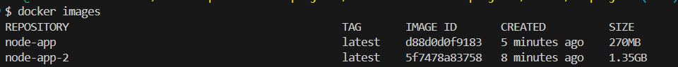

# **3. Node.js Application without Multi-stage builds**

- **Objective**: Dockerize a simple Node.js application.
- **Skills Covered**: Without Multi-stage builds, using environment variables, EXPOSE, WORKDIR.

  ## **Project Steps**

   1. **Create a Node.js App (`app.js`)**:

      ```javascript
      const express = require('express');
      const app = express();
      const port = process.env.PORT || 3000;

      app.get('/', (req, res) => {
        res.send('Hello from Node.js in Docker!');
      });

      app.listen(port, () => {
        console.log(`Server running on port ${port}`);
      });
      ```

   2. **Create a `package.json`**:

      ```json
      {
        "name": "node-docker",
        "version": "1.0.0",
        "main": "app.js",
        "dependencies": {
          "express": "^4.17.1"
        }
      }
      ```

   3. **Write the Dockerfile**:

      ```dockerfile
        FROM node:16

        WORKDIR /app

        COPY package*.json ./

        RUN npm install

        EXPOSE 3000

        CMD [ "node","app.js" ]
      ```

   4. **Build and run the container**:

      ```bash
      docker build -t node-app-2 .
      docker run -d -p 3000:3000 node-app-2
      ```

- **Outcome**: Visit `http://localhost:3000` to see "Hello from Node.js in Docker!".

**Multi-stage builds** in Docker are an advanced technique to create optimized, lightweight images by separating the build and runtime environments. This approach allows you to **build your application in one stage** and **copy only the necessary artifacts to the final image**. This results in a **smaller, more secure, and production-ready image**.

## **Why Use Multi-Stage Builds?**

1. **Smaller Images**: By only copying the final executable or required files to the final image, you significantly reduce the size.
2. **Better Security**: The final image contains only what’s needed to run the application, without unnecessary tools or dependencies (e.g., compilers, build tools).
3. **Cleaner Layers**: It keeps your image layers minimal, leading to faster image pulls and reduced attack surface.
4. **Simplified Dockerfiles**: Allows you to separate the build logic from the runtime, making Dockerfiles easier to read and maintain.

## **Summary of Multi-Stage Builds**

- **Use multi-stage builds to create images that are optimized for production.**
- **Build tools and dependencies are separated from the final runtime image.**
- **The final image only contains necessary files, reducing size and security risks.**

This is a powerful technique to **improve the efficiency, security, and performance** of Docker containers, making them ready for production deployment.

- Check and compare the size of the image node-app(with build stages) and node-app-2(without build stages).
  
