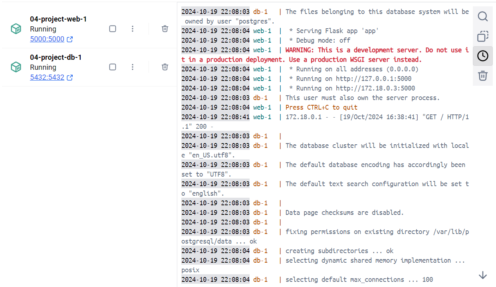
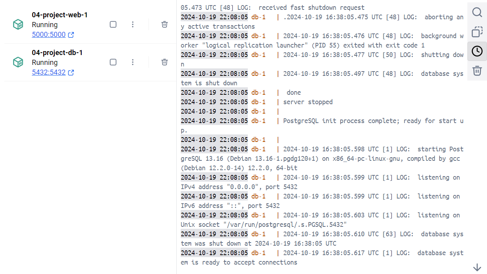
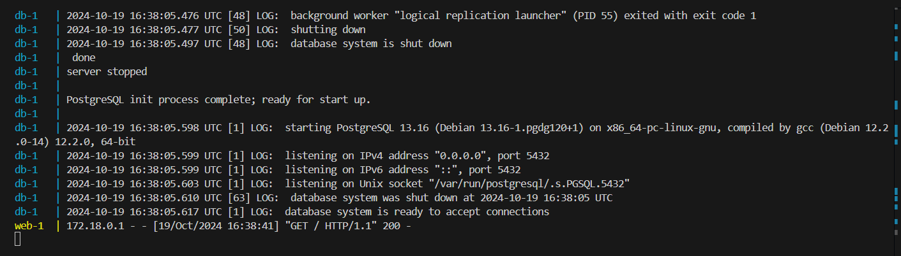
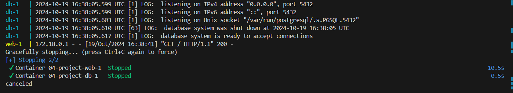

# **4. Python Flask App with PostgreSQL (Multi-Container Project)**

- **Objective**: Create a Python Flask app and connect it to a PostgreSQL database using Docker Compose.
- **Skills Covered**: Multi-container setups, Docker Compose, networking.

## **Project Steps**

   1. **Create a Flask App (`app.py`)**:

      ```python
      from flask import Flask
      import psycopg2

      app = Flask(__name__)

      @app.route('/')
      def hello():
          return 'Hello from Flask with PostgreSQL in Docker!'

      if __name__ == '__main__':
          app.run(host='0.0.0.0')
      ```

   2. **Create a `requirements.txt`**:

      ```
      flask
      psycopg2-binary
      ```

   3. **Write the Dockerfile**:

      ```dockerfile
      FROM python:3.9-slim

      # Set working directory
      WORKDIR /app

      # Install dependencies
      COPY requirements.txt .
      RUN pip install -r requirements.txt

      # Copy source code
      COPY . .

      # Expose port
      EXPOSE 5000

      # Run the application
      CMD ["python", "app.py"]
      ```

   4. **Create a `docker-compose.yml`**:

      ```yaml
      version: '3'
      services:
        web:
          build: .
          ports:
            - "5000:5000"
          depends_on:
            - db

        db:
          image: postgres:13
          environment:
            POSTGRES_USER: user
            POSTGRES_PASSWORD: password
            POSTGRES_DB: flaskdb
          ports:
            - "5432:5432"
      ```

   5. **Build and run the setup**:

      ```bash
      docker-compose up --build
      ```

- **Outcome**: The Flask app should be running on `http://localhost:5000`, with PostgreSQL running as a separate container.
- **Screenshots**: From command prompt, use "v" key to view the container in Docker Desktop. Below are the screenshots which shows how this app and db is running in Docker desktop in a separate container.

      